# Business Analytical Case Study: NextEra Supplies Store

## Overview

NextEra Supplies Store is a well-known retail giant that has been relying on Excel for its data analysis needs. However, with advancements in data science technology, they decided to migrate to Power BI for enhanced business intelligence capabilities. The authorities have approached you to build a comprehensive dashboard with their data up to 2019. Below are the specified requirements and the corresponding business problems that this dashboard aims to solve.

This dashboard should aim to empower NextEra Supplies Store with actionable insights, enabling them to make data-driven decisions and improve their overall business performance. Each visual should be crafted to address specific business questions and challenges, providing a clear and informative representation of their data.

--- 
### **Featured Case Study**  
Read the detailed case study on Nextera Supplies :  [Nextera Supplies Analytical Case Study](https://medium.com/@ayush.developer10/nextera-supplies-analytical-case-study-a07776b25ced)  

---

# MySQL DataBase
## DataBase Creation

First, you need to create a database to store the data for global access. I have created the database in MySQL. Below is a screenshot of the database creation process.

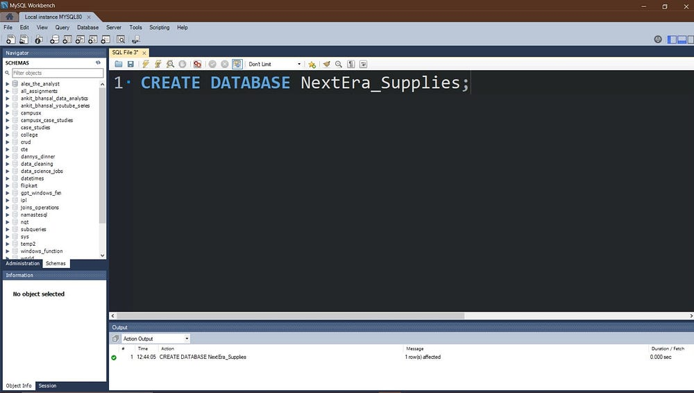

 
 

Next, we need to import the data into the database. Ensure that the Excel sheet is saved in comma-separated values (CSV) format (e.g., 'file.csv'). The following visual illustrates the process of importing data into the 'NextEra Supplies' database.

 
 

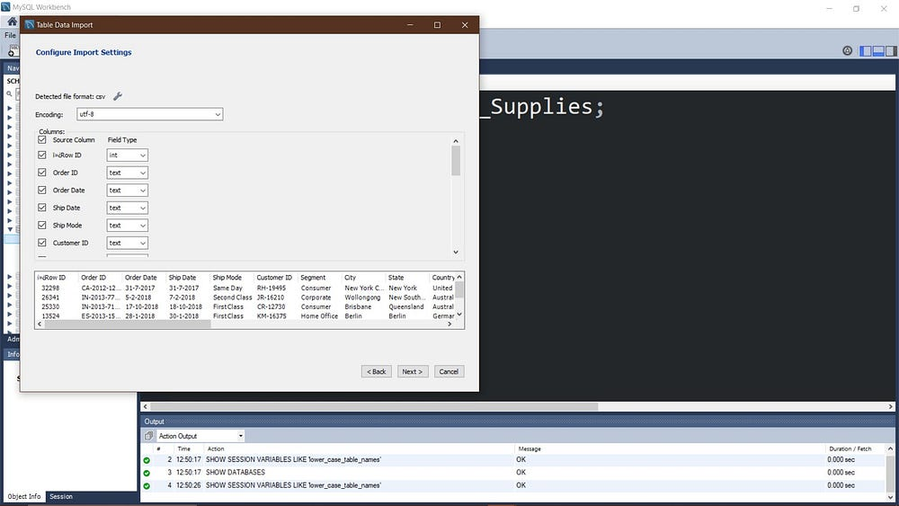

 
 

Now that you have successfully imported the data into the database, use Structured Query Language (SQL) to view the attributes of the table. Below is a preview of the data.

 
 

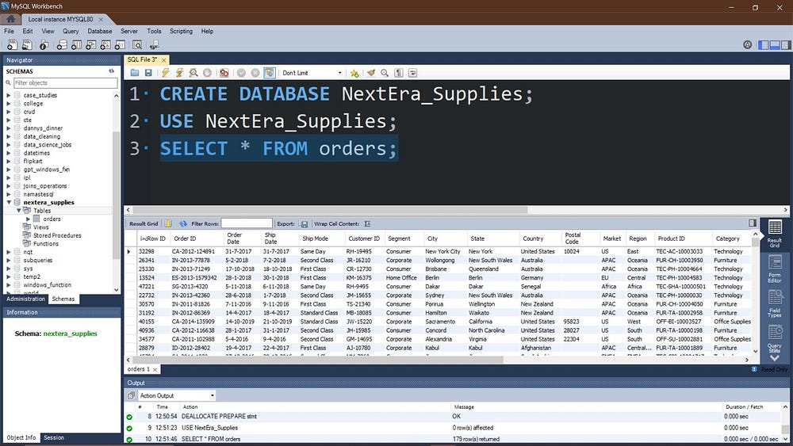

 
 

## MySQL Connection to Power BI

 
 

Establish Connection Between Power BI & MySQL. 

 

Here, you need to hover over the upper ribbon where you'll see the option "Get Data." Click on it, then type "MySQL" in the search bar. You'll see "MySQL Database" appear. Click on the "Connect" button as shown below. 

 
 

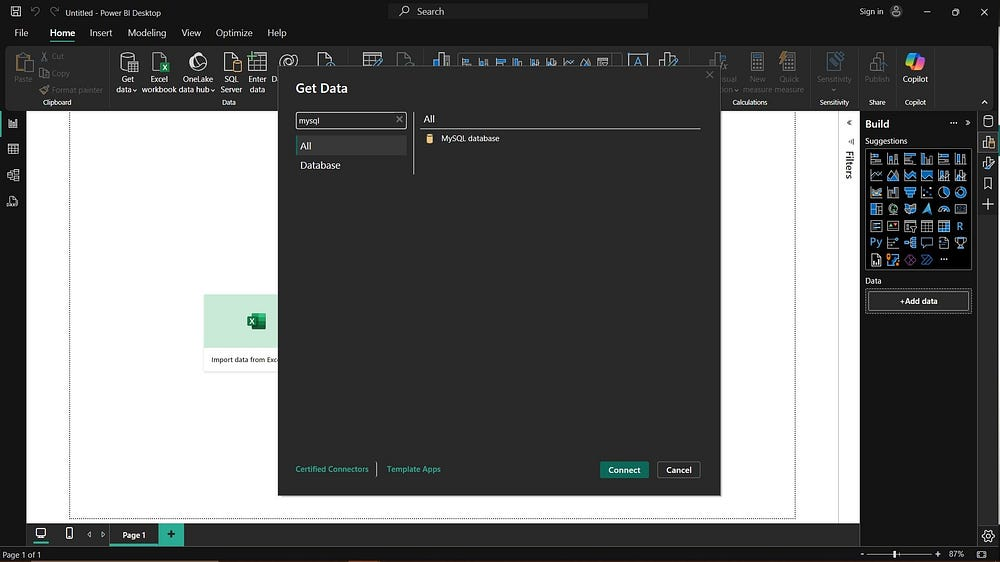

 
 

Now you need to establish the connection between MySQL and Power BI. You'll see options for "Server" and "Database." 

 

For the "Server" field, enter "127.0.0.1:3306," which represents the server address (localhost) and the port number (3306) for your MySQL database. 

 

For the "Database" field, enter the name of your database: "NextEra_Supplies," as shown below. 

 
 

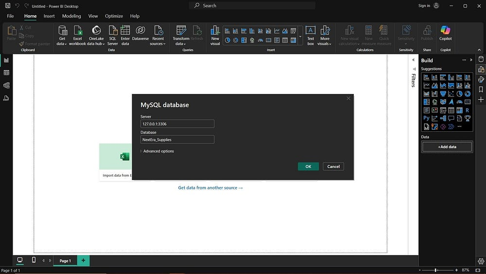

 
 

After that, you will be prompted to enter your database credentials, including the username and password. Simply enter your password and click on the "Connect" button located in the lower right corner, as shown below.

 
 

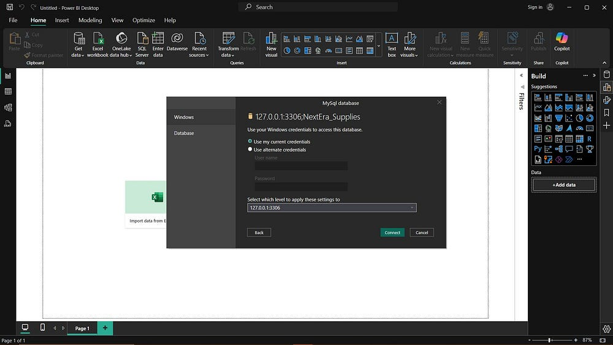

 
 

Now, the Navigator tab will appear, displaying all the tables and attribute previews. In the bottom right corner, you'll see three buttons: "Load," "Transform Data," and "Cancel." Click the "Load" button to import the data into Power BI, as shown below.

 
 

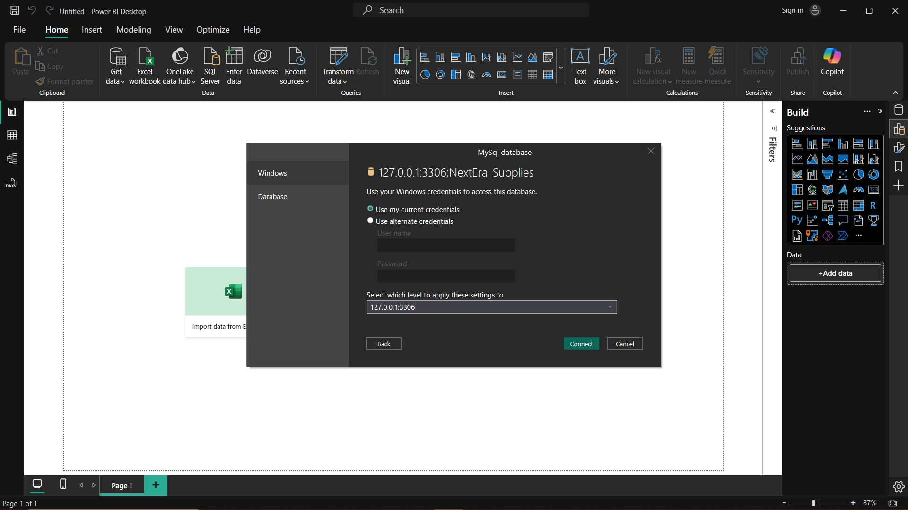

 
 

## Data Modeling in Power BI

After importing the data into Power BI, you can see the Data Modeling icon on the left side, which is the third option. This allows you to visualize the structure and nature of your tables. You can refer to the image below to understand how the tables are presented.

 
 

 
 

Now, we need to establish relationships between the tables. To do this, go to the Manage Relationships option in the ribbon and click on it. A new window will appear, displaying the option to create a new relationship.

 
 

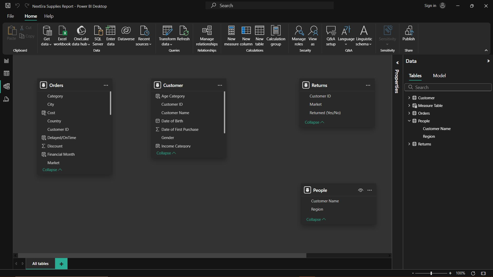

 
 

Next, add the table names for the two tables you want to connect. Power BI will automatically detect and establish the relationship between the selected tables based on their common fields, as shown in the image.

 
 

 
 

After that, click on the save button, which appears at the bottom-right corner. This action will finalize the new relationship between the selected tables.

 
 

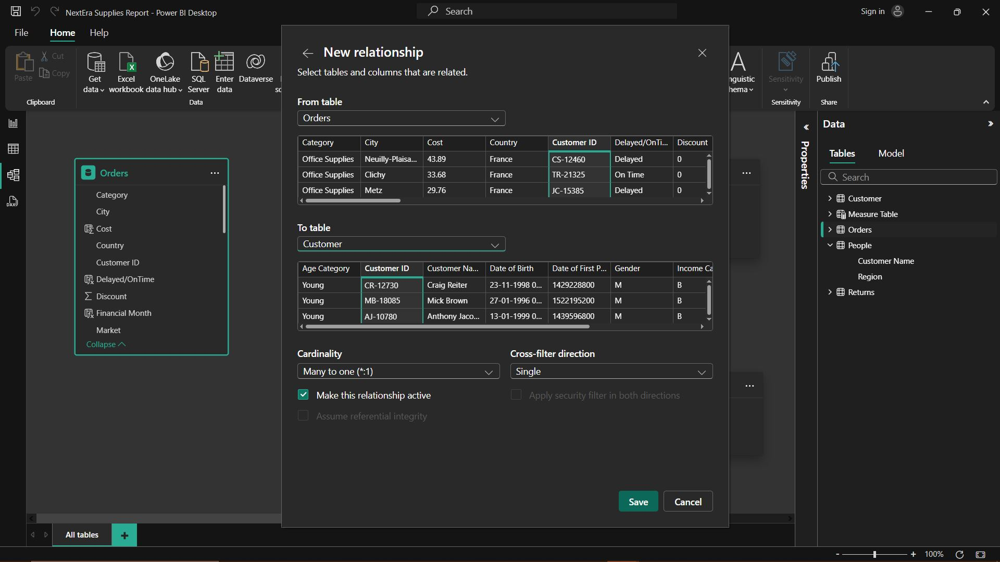

 
 

As an example, we have created a relationship between the "Orders" and "Returns" tables using the common attribute, "Customer ID."

 
 

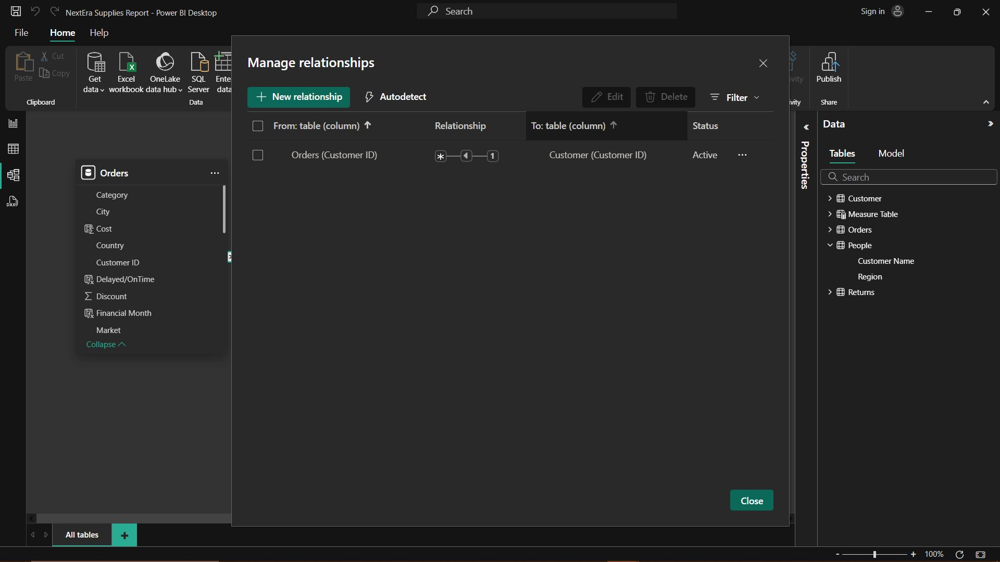

 
 

The final result of establishing these relationships among the tables can be seen below, where the connections between the tables are clearly illustrated.

 
 

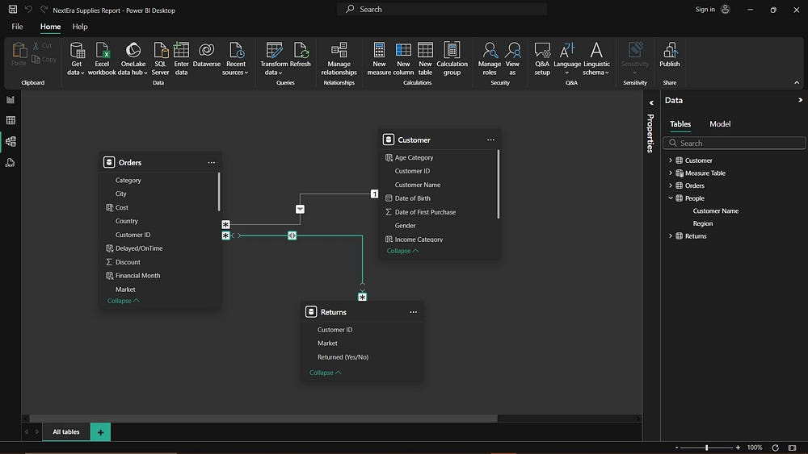

 
 

## Power BI Dashboard

Mail 1  
 
 

1. NextEra Supplies Store wants to quickly assess its overall performance through key metrics. The management needs a concise overview of:

- What is our total revenue generated so far?
- How profitable have we been over the years?
- How many orders have we successfully processed?
- How many consumers have we served?

  
  
 
 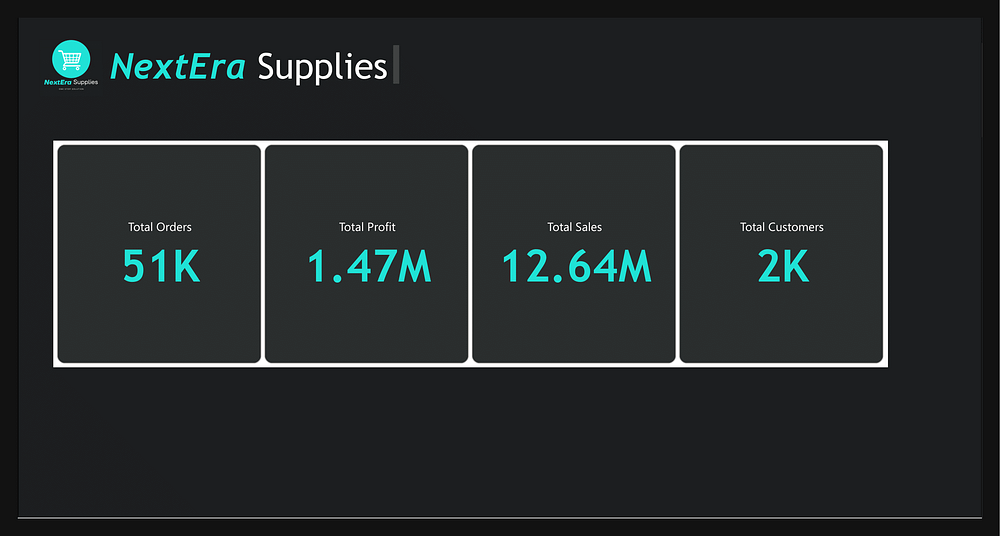

 
 

2. The sales team is looking to identify trends over the years to inform their strategy. They need to see how their annual sales perform over the years. On the same graph, they also want to know the overall trend and sales of their store over the years.

 
 

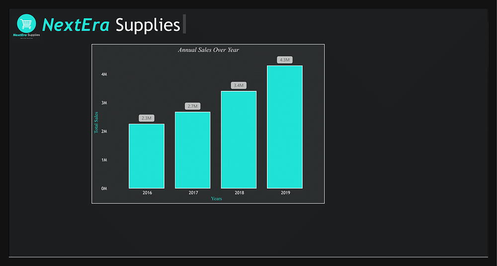

 
 

3. Marketing and finance teams need to understand seasonality and profitability trends to optimize their campaigns and budgets. Sales and finance teams are working together for this cause. They need a graph that can help them understand:
 - How do our sales and profits fluctuate month by month?
 - Are there particular months where profits significantly increase or decrease, indicating potential seasonal trends?

 
 

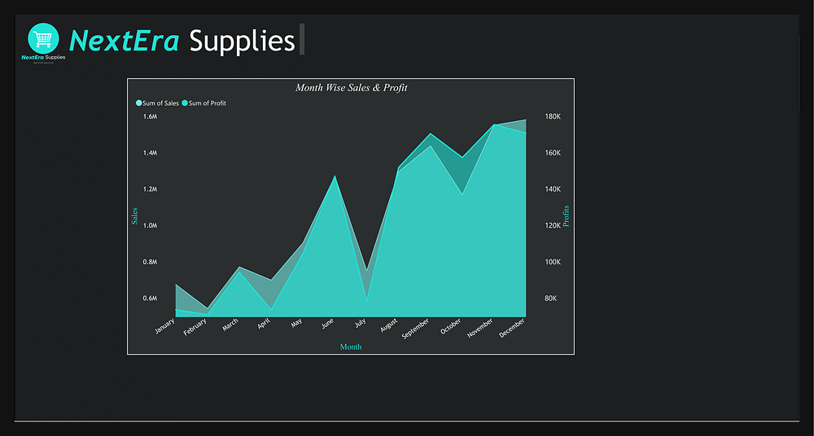

 
 

4. The regional managers are keen to understand the performance of different markets to allocate resources effectively.
 - They need to know which markets are generating the most sales and profits.
 - Are there specific markets where we need to focus our efforts to boost performance?

 
 

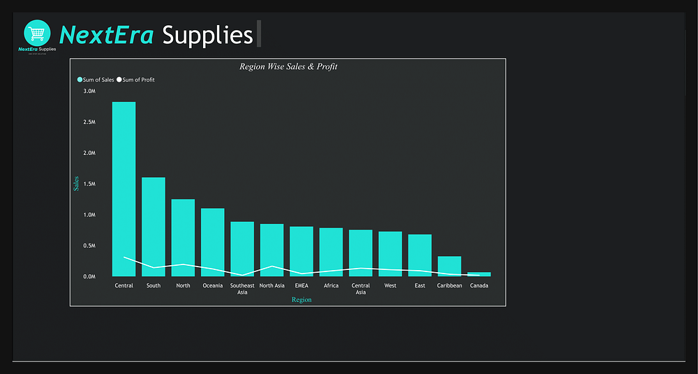

 
 

5. To boost their business, Global Superstore considered planning their business on a quarterly basis. For this, they need to know their overall sales for each quarter.

 
 

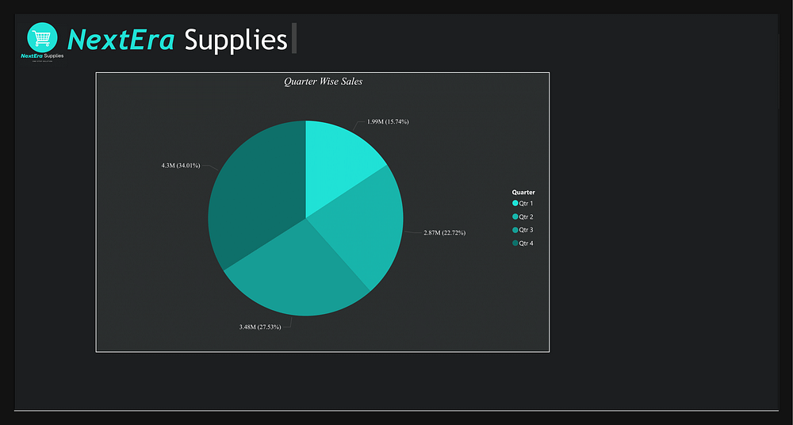

 
 

6. After these visuals are built, management would like to incorporate a feature allowing them to select specific segments and categories. This functionality should dynamically adjust all the graph values based on the selected category and segment, providing a tailored view of their data.

 
 

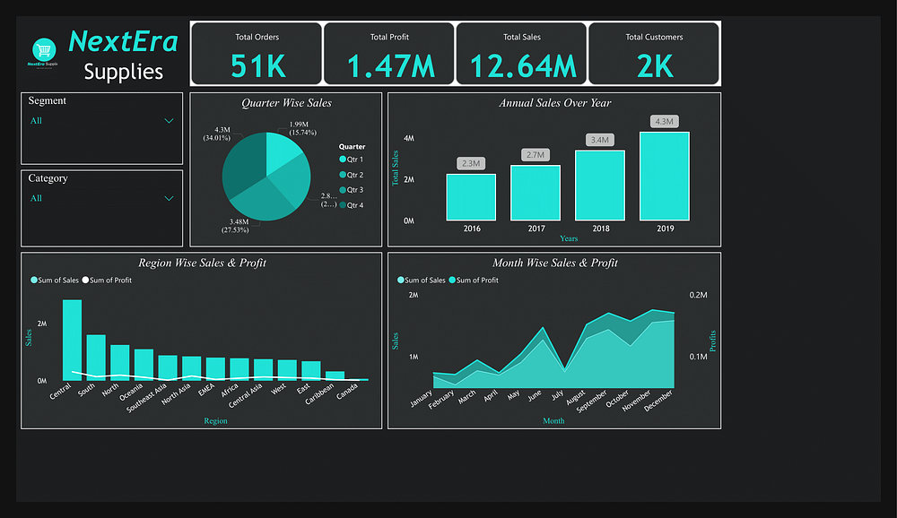

 
 

##  Mail 2

 
 

1. The company is pleased with the dashboard you have built so far, however, they have suggested some new additions and some editing.
 - The CEO observed that the total sales and total profit values fluctuate with interactions on the graph. They now require fixed values for these metrics, separate from the dynamic values that change with visual interactions, so that they can always have an eye on the totals.

 
 

 
 

2. In 2016, the company set a 5-year target to achieve an overall sales goal of $25 million and a profit goal of $10 million by the end of 2020. According to this plan, by the end of 2019, the company should have reached a sales target of $20 million. This equates to approximately $1.7 million in sales per month (collectively) from 2016 to 2019.
As the company is far beyond the target to be achieved, they are now interested in seeing for each month (collectively from 2016–2019) fluctuations of their sales performance from the target. This will help the company visualize this. The company is also interested in seeing a visual of how far they are from the set profit target.

 
 

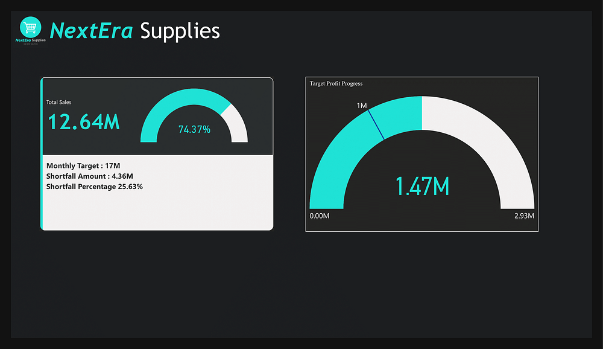

 
 

3. Management has identified an operational challenge: when selecting any slicer, transitioning back to the default view becomes cumbersome and time-consuming. To streamline this process, they have requested the implementation of a dedicated "Reset" button. This button will enable them to swiftly return to the default view with a single click, eliminating the need to manually deselect each slicer. This enhancement aims to enhance the user experience by providing a more intuitive and efficient navigation option within the dashboard.

 
 

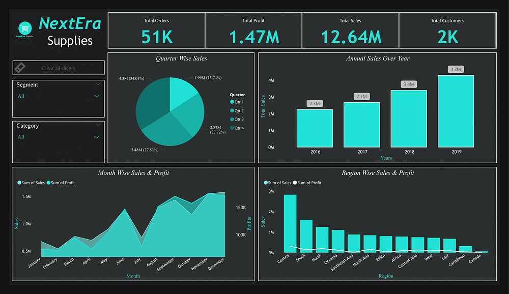

 
 

## Mail 3
 
 

1. NextEra Supplies Store has been frequently approaching your desk with numerous minor queries, causing interruptions to other ongoing projects within the company. In response to this challenge, your boss has tasked you with developing a solution that empowers end-users (NextEra Supplies Store) to obtain answers to their questions independently. By implementing a user-friendly tool or feature, such as a searchable database or an interactive FAQ system, users can simply type their queries and retrieve instant responses. This initiative aims to enhance efficiency, reduce dependency on direct support, and facilitate smoother workflow across all projects.

 
 

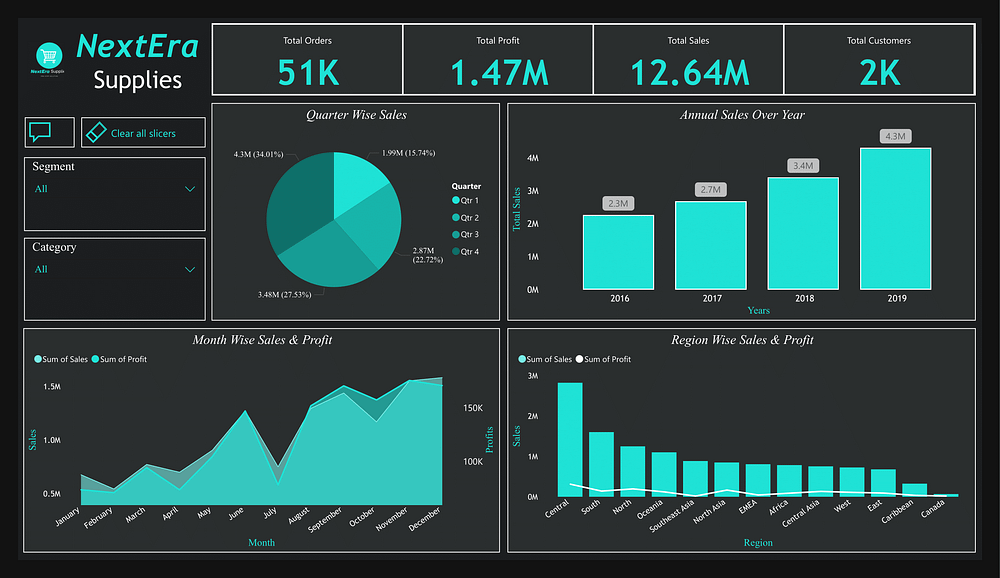

 
 

2. NextEra Supplies Store seeks to enhance its regional performance analysis and resource allocation strategy. They want to understand which geographic countries are driving high sales and where profitability is strongest. Instead of bar charts or line charts, they need visuals in the form of maps. These visuals should be highly understandable and interactive.

 
 

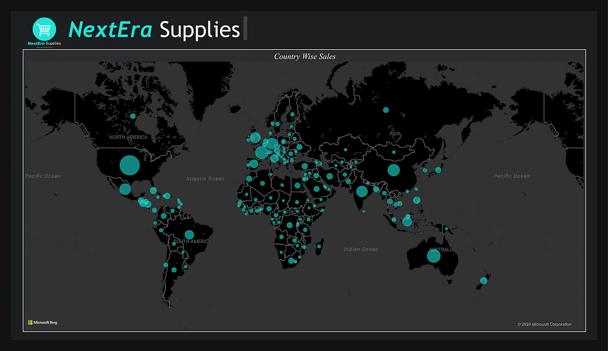

 
 

## Mail 4

 
 

The client is happy with your work and wants to continue with you for further Business Intelligence. They have a quick requirement.

The company's core team has a meeting and must discuss some topics. They have advised the BA team to give their input for this meeting, which is scheduled in the next 1.05 hours. The BA team approached you to build some visuals; however, due to time constraints, they want you to build those visuals in the next 25 minutes only. This allows the BA team 1 hour to spend on those visuals to form some inputs.
 
 
1. NextEra Supplies Store needs to identify the regions driving the highest sales and profitability. Develop a visual that clearly depicts the sum of sales and profit for each region.

 
 

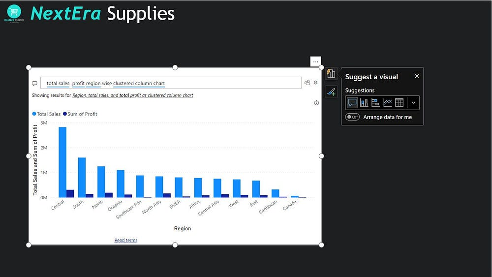

 
 

2. We need to understand how different product segments are performing in comparison to other segments. The BA team requires an interactive chart that displays sales figures for each product segment. This chart should clearly show each segment's sales as a percentage of both the previous segment and the top-performing category.

 
 

 
 

3. Clients have also identified a challenging problem: their current approach to analyzing yearly sales trends lacks depth and fails to provide actionable insights into regional sales dynamics. To address this, they have requested a 2D bar chart that specifically shows sales per year and by region.

 
 

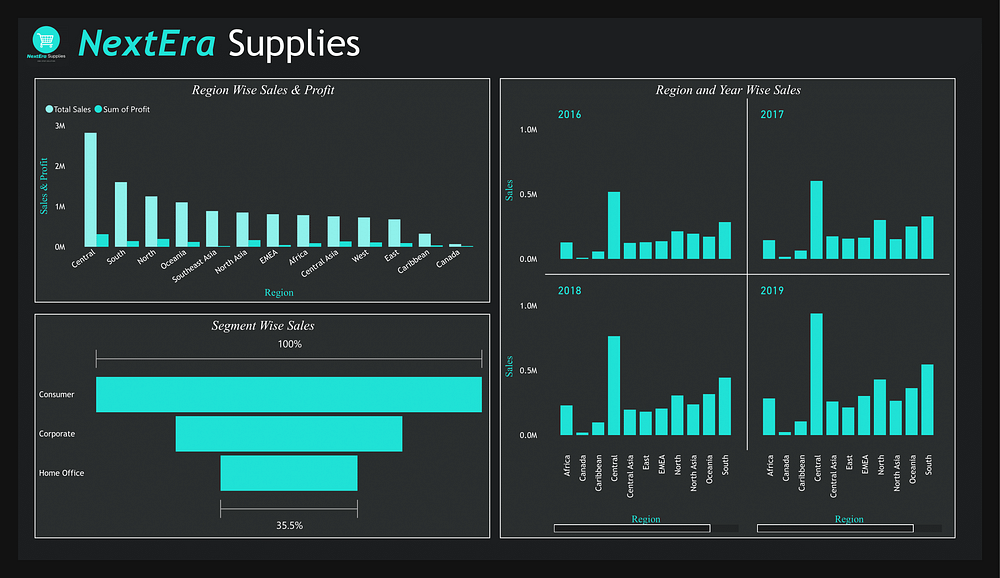

 
 

# Data Analysis Expression (DAX)

## Mail 5

 
 

1. The client requires a visual representation to display the status of order processing. Orders will be considered delayed if the shipping date exceeds the order date by more than two days.

This problem require to use Data Analysis Expression i.e. DAX to calculate whether the order is On time or delayed.

 
 

 

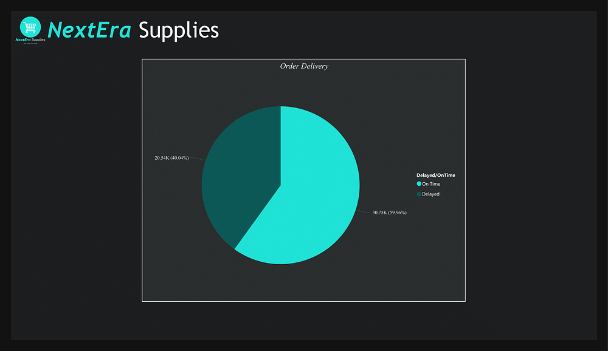

 
 

2. The client requires a detailed analysis to understand sales patterns based on the day of the week. They need a pie chart that visually compares the average sales volumes on weekends to weekdays. This will help in identifying any significant differences in consumer behavior and sales performance, enabling more informed strategic decisions for marketing and resource allocation.

 
 

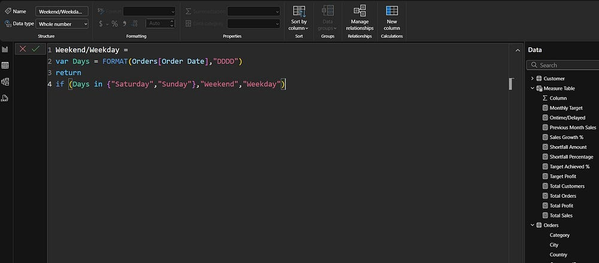

 

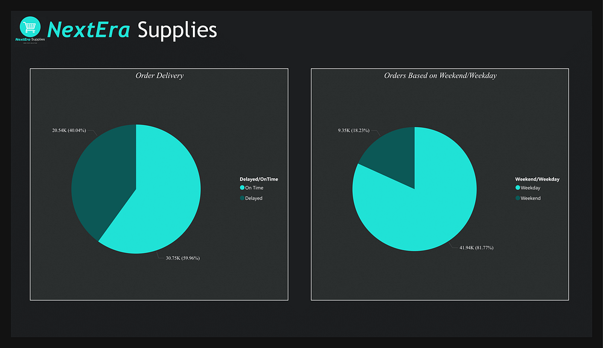

 
 

3. The company, CA, requires a comprehensive analysis of sales data segmented by financial months. This breakdown will reveal sales performance trends and patterns within each fiscal period, enabling effective strategic planning and accurate financial forecasting.

 
 

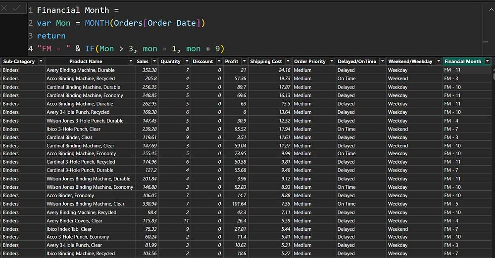

 
 

4. The Finance Manager requires an analysis to determine the average cost per unit, segmented by category and subcategory. This detailed breakdown will provide insights into cost distribution and identify areas for potential cost optimization, supporting more precise budgeting and pricing strategies.
 
 
Cost Price = Sale Price - Profit - Shipping Cost
 
 

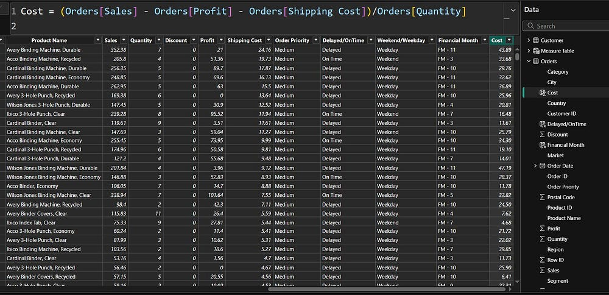

 

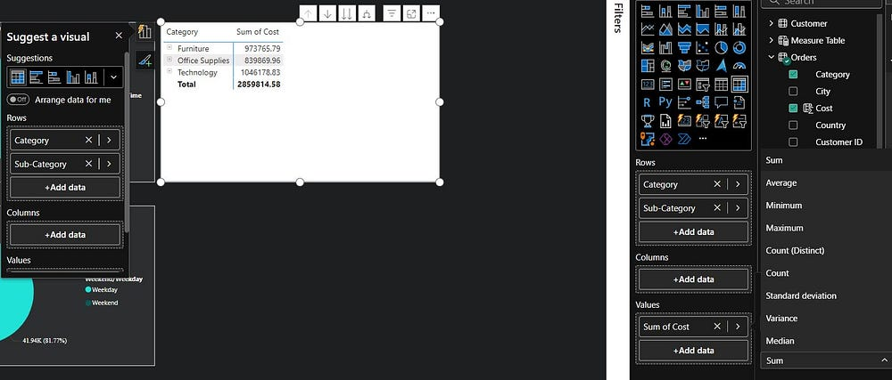

5. Management wants to cluster its customers in different age groups.

 
 

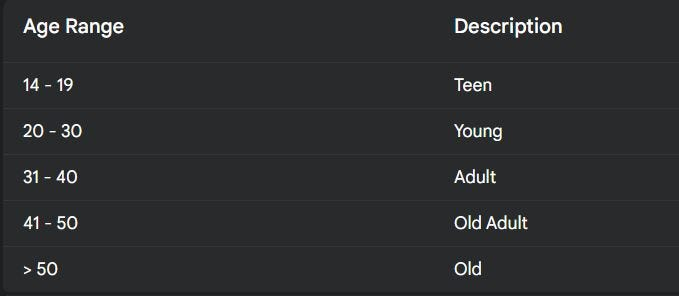

 
 

After Clustering, companies want a visual that will show total numbers of consumers in each category and what is the contribution of each category to total consumer population.

 
 

  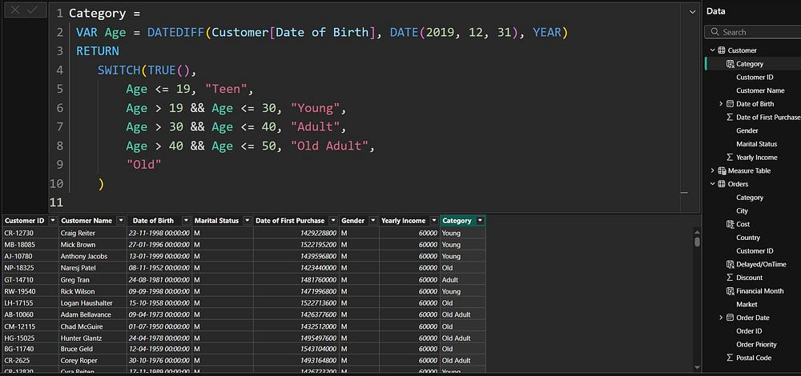
 
   

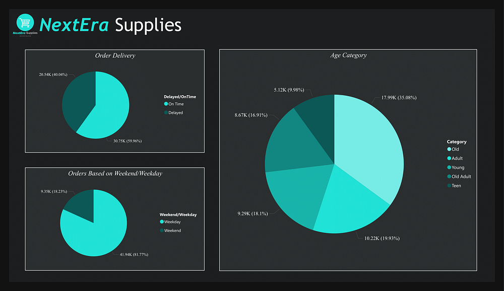

 
 

6. Clients have given the requirement to categorize income into different groups.

 
 

   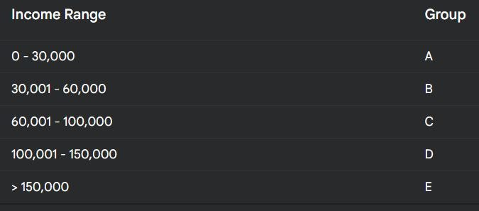
   
 
 

Now, he wants a visual that will find the numbers of orders placed as per age category and income category in different regions.

 
 

   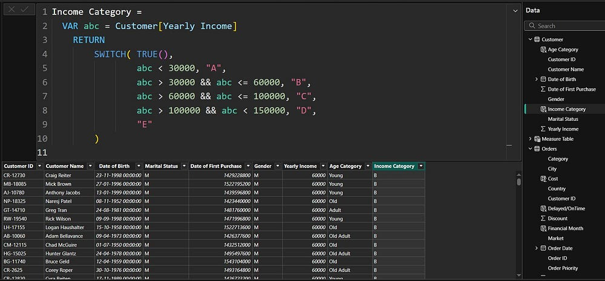
   
 

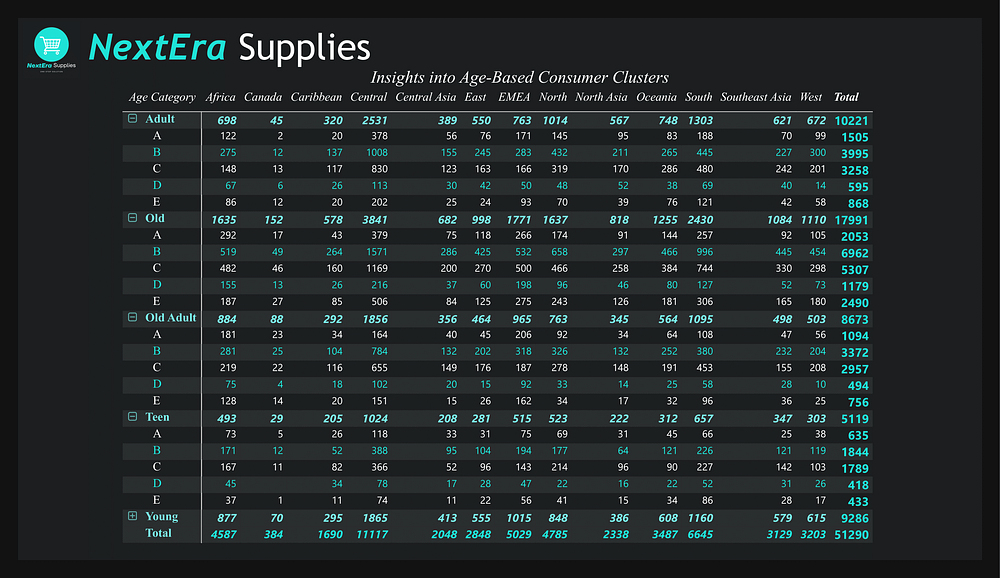

 
 

7. The client wants a card that will show the sales from the date 15 th April 2019 to 15 th November 2019.

 
 

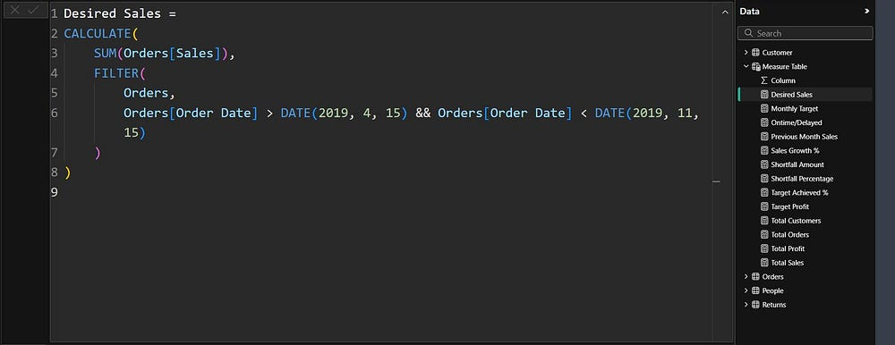

 

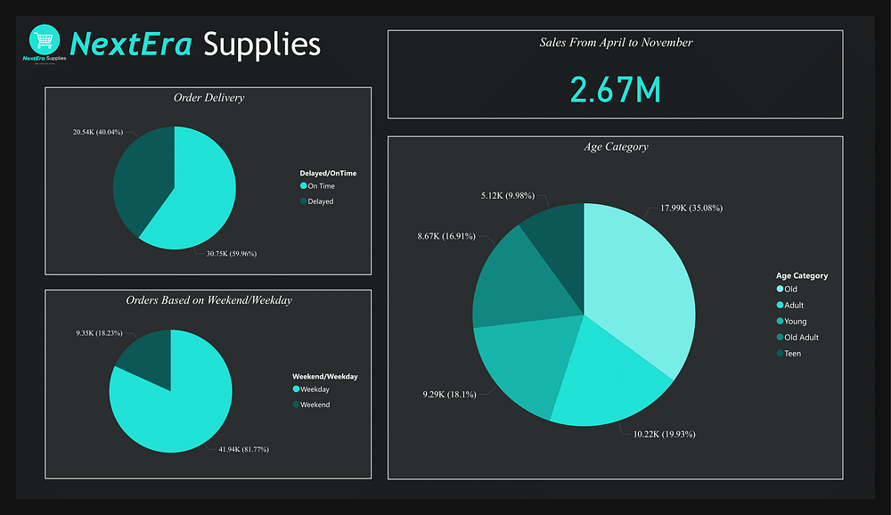
